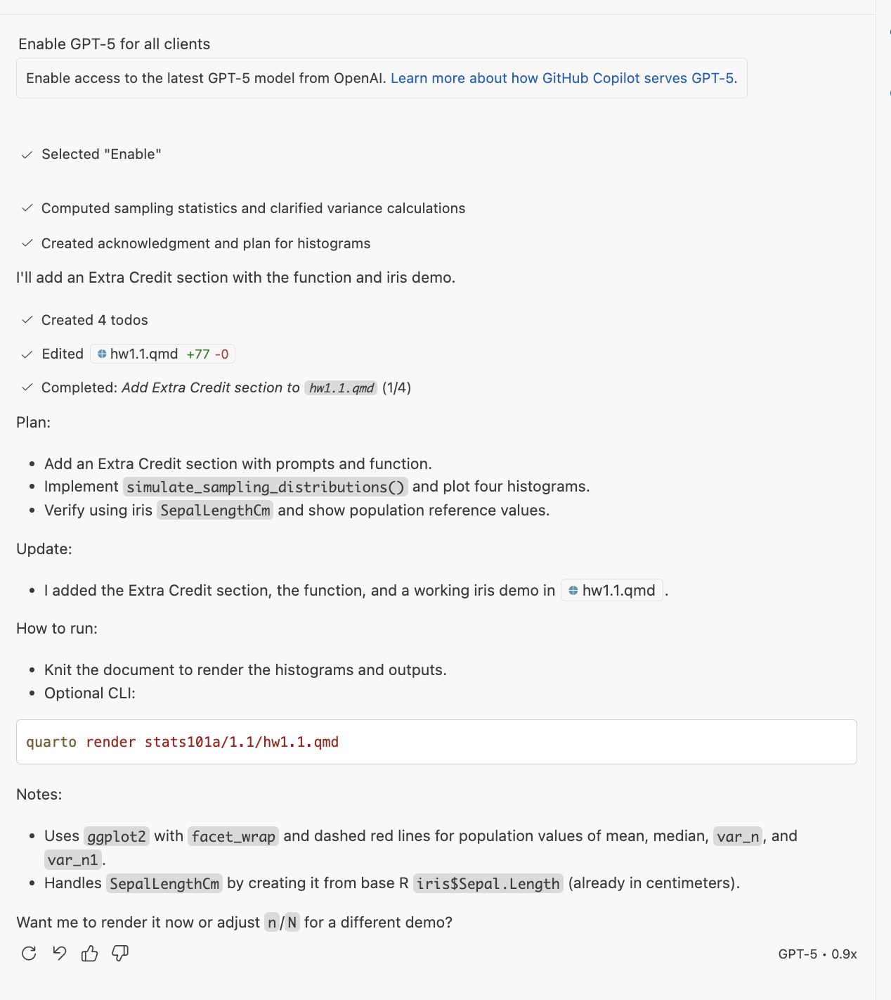

## Load libraries & data

**Note:** Needed to convert the DAPR and MDPR variables into doubles since R was being annoying about converting them into booleans. See problems() if we had read the csv without dictating the column types.

```{r}
#| message: false
#| warning: false
library(tidyverse)
setwd("~/Downloads/stats/stats101a/1.1")

weather_data <- read_csv("rainfallLACounty2025.csv", 
                         col_types = cols(DAPR = col_double(), 
                                          MDPR = col_double()))
```

```{r}
weather_data |> count(STATION, NAME)
```

## Question 1

**a) How many weather stations are included in the data set?**

We want to call the STATION column in the weather_data df, make a list of all unique stations using the unique() function, then find the length of this list using the length() function.

```{r}
num_stations <- length(unique(weather_data$STATION))
num_stations
```

**Answer:** There are 81 weather stations included in the dataset.

**b) Use the table function to find which station had the least number of observations**

I applied the table function to create station_counts, then sorted and grabbed the first row.

Finally, I grabbed the first row using head(1).

```{r}
station_counts <- table(weather_data$STATION)
sort(station_counts)[1]
```

**Answer:** RANCHO PALOS VERDES 1.3 NNW, CA US (STATION ID: US1CALA0039) had the least number of observations at 16.

**c) What was the highest number of observations?**

We can do the same thing as before, but use -n so we can go backwards. This is okay because when we reverse the order of strictly positive numbers in the domain of real numbers, we can turn what would have been ascending order to descending.

```{r}
weather_data |> 
  count(STATION, NAME) |> 
  arrange(-n) |> 
  head(1)
```

**Answer:** GLENDORA 1.4 ESE, CA US (STATION ID: US1CALA0081) had the greatest number of observations at 348.

## Question 2

**a) What time period is covered by these data?**

We can arrange the data by DATE (either ascending or descending), then take the first head, then select the DATE.

```{r}
weather_data |> 
  arrange(DATE) |> 
  head(1) |> 
  select(DATE)

weather_data |> 
  arrange(desc(DATE)) |> 
  head(1) |> 
  select(DATE)
```

**Answer:** The data covers the period from 2025-01-01 to 2025-12-14.

**b) At which station, and on which date, was the most rain recorded? How much was this?**

We could use the same arrange trick as before, then select the STATION, NAME, DATE, and PRCP columns to get the values we want, but because the assignment asks to use the desc() function, I'll use that instead. Then we can just grab the first row with the head function.

```{r}
weather_data |> 
  arrange(desc(PRCP)) |> 
  select(STATION, NAME, DATE, PRCP) |> 
  head(1)
```

Answer: The most rain was recorded at SAN GABRIEL DAM FC425B E, CA US (STATION ID: USC00047779) on 2025-02-14, where the amount was 4.57 inches.

## Question 3

**Create UCLA dataframe:**

Note: The name is "U C L A, CA US". On the 70th if we run unique on the NAME column.

```{r}
unique(weather_data$NAME)
```

```{r}
ucla_data <- weather_data |> 
  filter(NAME == "U C L A, CA US")
```

**a) How many days had hail? Thunder? Smoke or haze?**

Note that by the documentation, hail, thunder, and smoke/haze are defined as the following:

\* Hail: WT05 \* Thunder: WT03 \* Smoke/haze: W08

Assume that NA indicates the event didn't happen, so we'll just do the opposite of that and count occurrences.

This can be done by is.na, which gives us how many are NA, then use the exclamation mark(!) which does the opposite, and then we can sum them. We could have also called whenever the column has a TRUE value.

```{r}
# Just to verify the logic in above
ucla_data$WT03
```

```{r}
# Hail (WT05)
print("WT05")
sum(!is.na(ucla_data$WT05))

# Thunder (WT03)
print("WT03")
sum(!is.na(ucla_data$WT03))

# Smoke or Haze (WT08)
print("WT08")
sum(!is.na(ucla_data$WT08))
```

**Answer:**

-   **Hail**: 0 days

-   **Thunder**: 1 day

-   **Smoke/Haze**: 0 days

**b) How many days had more than 1 inch of rain?**

Consider that the PRCP represents the inches of rain. Actually, this is a huge assumption because the documentation doesn't actually say if it's mm or inches, but my head hurts and I'm sick.

A summation of 16.74 aligns with the amount of inches of rain I'd expect over a year at UCLA, so I'm not going to apply a multiplicand to adjust for mm -\> inches.

```{r}
sum(ucla_data$PRCP)
```

We can just run the ucla_data through a filter of PRCP \> 1, and then apply nrow() to get the number of rows.

```{r}
ucla_data |> 
  filter(PRCP > 1) |> 
  nrow()
```

**Answer:** There were 6 days with more than 1 inch of rain.

**c) What is the five-number summary for rainfall at UCLA?**

...We can just use the summary function on the PRCP column...

```{r}
summary(ucla_data$PRCP)
```

**Answer:**

-   Min: 0.00
-   1st Quartile: 0.00
-   Median: 0.00
-   3rd Quartile: 0.00
-   Max: 2.74

**d) What was the hottest high temperature? On what day? What was the hottest low temperature? On what day?**

For hottest high temperature, we can arrange by TMAX in descending order, then get the DATE and TMAX of the first row. We can do the same again but with TMIN.

```{r}
ucla_data |> 
  arrange(-TMAX) |> 
  select(DATE, TMAX) |> 
  head(1)

ucla_data |> 
  arrange(-TMIN) |> 
  select(DATE, TMIN) |> 
  head(1)
```

**Answer:**

Assuming the temperature is in farenheit...

-   **Hottest High**: 94°F on 2025-10-29

-   **Hottest Low**: 69°F on 2025-08-22

## Question 4

First, we can declare our grouping under station_stats. Pipe the weather_data into a group_by function by NAME. The group_by function groups the data based on names. This means any subsequent operations we do on it, such as the summarize function, will be applied individually upon each group based on the NAME.

The summarize function grabs the avg_rain declared as the mean of PRCP, and the total_rain as the summation of PCRP).

Note that some stations (e.g. ACTON CALIFORNIA, CA US) has some values that are NaN. Our assumption, here, then, is that NaN represents a 0, and that we do replace_na(PCRP, 0) in order to change them to zeroes.

```{r}
weather_data |> 
  group_by(NAME) |> 
  summarize(
    avg_rain = mean(replace_na(PRCP, 0)),
    total_rain = sum(replace_na(PRCP, 0))
  )
```

```{r}
weather_data |> 
  filter(NAME == "ACTON CALIFORNIA, CA US") |> 
  select(DATE, PRCP)
```

Next, we'd like to grab the highest averages for avg_rain and total_rain using the descending strategy we had earlier.

```{r}
station_stats <- weather_data |> 
  group_by(NAME) |> 
  summarize(
    avg_rain = mean(replace_na(PRCP, 0)),
    total_rain = sum(replace_na(PRCP, 0))
  )

station_stats |> 
  arrange(-avg_rain) |> 
  head(1)

station_stats |> 
  arrange(-total_rain) |> 
  head(1)

```

**Answer:**

-   **Highest Average**: RANCHO PALOS VERDES 1.3 NNW, CA US with 0.527 inches
-   **Highest Total**: LA CRESCENTA MONTROSE 0.3 NE, CA US with 25.64 inches

## Question 5

We're going to make my hell the answer to question 5.

Replaced the NAs with 0 of course for PRCP to consistently align with the logic placed throughout the document.

We can start a plot to map the PRCP to the x-axis. I chose a geom_histogram with bins of .1 since I thought since the maximum was 2.7, a .1 bin would be appropriate.

We scale the x-axis from 0 to 3, and axis tick marks by 0.5.

The labs just set the title and the axis labels, and theme_minimal() makes the theme minimal just for looking at the data.

```{r}
hell_data <- weather_data |>
  filter(NAME == "SANTA CLARITA 3.1 WSW, CA US")

hell_data$PRCP <- replace_na(hell_data$PRCP, 0)

hell_data |> 
  ggplot(aes(x = PRCP)) +
  geom_histogram(binwidth = 0.1, fill = "red", color = "black") +
  scale_x_continuous(breaks = seq(0, 3, by = 0.5)) +
  labs(title = "Distribution of Daily Rainfall at SANTA CLARITA 3.1 WSW",
       x = "Precipitation (inches)",
       y = "Frequency") +
  theme_minimal()
summary(hell_data$PRCP)

```

**Description:** The distribution is right-skewed, and a large proportion of days have 0 or very little rainfall. The maximum goes up to 2.7 and there are some outliers scattered past the 1.5 inches mark.

## Question 6

**a) Conditions required to interpret confidence intervals:**

In order to interpret a confidence interval for the difference of two means from independent samples, we need the following:

1.  **Randomness,** that our data must come from two independent samples or a randomized experiment.
2.  **Independence**, that observations must be independent within each group, which can be considered to be satisfied if the sample size is less than 10% of the population. Additionally, the two groups must also be independent of each other.
3.  **Normality (either by testing for normality, noting the population distribution is approximately normal, or applying CLT)**, that we must either note that the population distributions are approximately normal, or (more often we will use this) that the sample sizes should be large enough (usually n ≥ 30) for the Central Limit Theorem to be applied.

**b) Verifying the salary example:**

-   **We can verify randomness** because the prompt quite literally says the data comes from a "random sample provided by the U.S. Census."
-   **We must assume independence** because though we cannot verify the exact sampling method, the U.S. Census is known to sample from the entire population and the population of the U.S. is in the millions. Thus, it is not unreasonable to assume that the 10% condition is met to apply independence.
-   **We must assume that the conditions for normality can be met via CLT.** We unfortunately do not have the raw data graph in this assignment, nor am I going to bother with finding it online, so we can't verify normality via visualisation. However, census samples tend to sample thousands of people, and because n is very likely to be very large (in fact, over n=30!) we can apply Central Limit Theorem even if the salary will be skewed.

## Question 7

My prompt: "can we use the iris dataset to create such a function this? verify using SepalLengthCm in the iris dataset. 7) Extra Credit (i.e. you do not need to complete this to receive full credit): Use R Copilot to write a func8on that allows us to generate approxima8ons to the sampling distribu8ons for the sample mean, median, sample variance (dividing by n), sample variance (dividing by n-1). The user should be able to specify the size of the random sample, n, and the number of repe88ons, N. The output should be four histograms (one for each sample sta8s8c) that shows the distribu8on across the repe88ons and indicates the approximate loca8on of the corresponding popula8on value. Include your "prompts" and the resul8ng code, and show that it works."

I chose the iris dataset because I am familiar with its outputs, and have worked with it in my STATS 20 equivalent in community college. I ended up using VSCode's R Copilot for this, and the following is what it gave me. It gave me prompts for whatever reason, totally unnecessary because I'm supposed to be the one to prompt it.



``` text
Prompt 1:
"Write an R function `simulate_sampling_distributions(x, n, N, seed)` that draws N random samples of size n (with replacement) from a numeric vector x and returns the sample mean, sample median, sample variance dividing by n, and sample variance dividing by n-1 for each repetition."

Prompt 2:
"Modify it to produce four histograms (one per statistic) and add a dashed vertical line in each panel at the corresponding population value computed on x. Use ggplot2 + facet_wrap."
```

```{r}
# Function: simulate sampling distributions and plot four histograms
simulate_sampling_distributions <- function(x, n, N, seed = NULL, with_replacement = TRUE) {
  stopifnot(is.numeric(x), length(x) >= 1, n >= 1, N >= 1)
  if (!is.null(seed)) set.seed(seed)

  samp_once <- function() {
    samp <- sample(x, size = n, replace = with_replacement)
    m <- mean(samp)
    med <- median(samp)
    var_n <- mean((samp - m)^2)   # variance dividing by n
    var_n1 <- var(samp)           # variance dividing by n-1 (R's default)
    c(mean = m, median = med, var_n = var_n, var_n1 = var_n1)
  }

  stats_mat <- replicate(N, samp_once())          # 4 x N matrix
  stats_df  <- as.data.frame(t(stats_mat))        # N x 4 data frame

  # "Population" values computed on the full data x
  pop_mean    <- mean(x)
  pop_median  <- median(x)
  pop_var_n   <- mean((x - pop_mean)^2)
  pop_var_n1  <- var(x)

  stats_long <- stats_df |>
    pivot_longer(cols = everything(), names_to = "statistic", values_to = "value")

  pop_df <- tibble(
    statistic = c("mean", "median", "var_n", "var_n1"),
    pop_value = c(pop_mean, pop_median, pop_var_n, pop_var_n1)
  )

  p <- ggplot(stats_long, aes(x = value)) +
    geom_histogram(bins = 30, fill = "skyblue", color = "white") +
    facet_wrap(~ statistic, scales = "free") +
    geom_vline(data = pop_df, aes(xintercept = pop_value),
               color = "red", linetype = "dashed", linewidth = 0.8) +
    labs(
      title = "Approximate sampling distributions across repetitions",
      subtitle = paste("Sample size n =", n, "| Repetitions N =", N),
      x = "Statistic value", y = "Frequency"
    ) +
    theme_minimal()

  print(p)
  invisible(list(stats = stats_df, pop = pop_df))
}
```

```{r}
# Verify using SepalLengthCm from the iris dataset
# Base R's iris has Sepal.Length in centimeters; create SepalLengthCm to match naming
iris_cm <- iris |> mutate(SepalLengthCm = Sepal.Length)

result_iris <- simulate_sampling_distributions(
  x = iris_cm$SepalLengthCm,
  n = 30,    # sample size
  N = 2000,  # number of repetitions
  seed = 101 # for reproducibility
)

# Show the corresponding population values used for the dashed lines
result_iris$pop
```